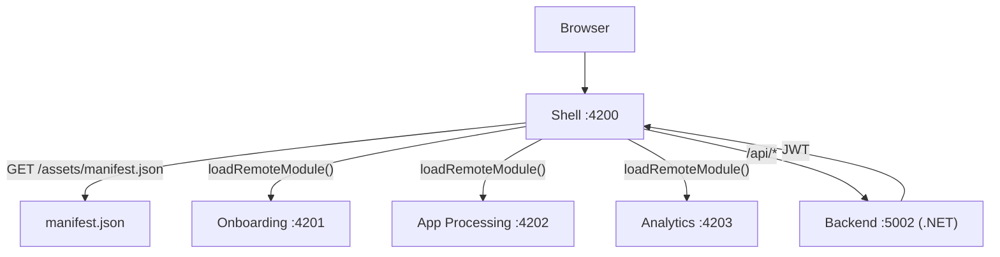
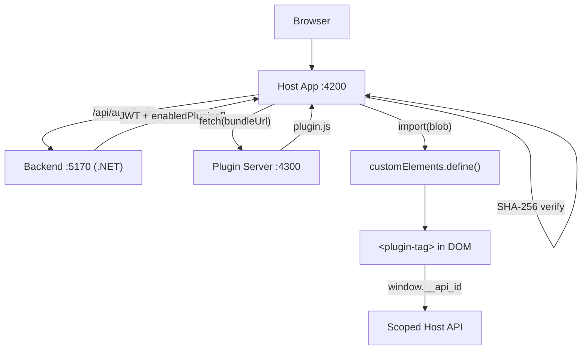

# Microfrontend vs Plugin Platform -- Comparison

## Quick Reference

| Dimension | Microfrontend | Plugin Platform |
|---|---|---|
| **Pattern** | Shell + Remote MFEs | Host + Runtime Plugins |
| **Federation** | Native Federation (ESM import maps) | Custom fetch + Web Components |
| **Deployment** | Each MFE deployed independently | Each plugin deployed independently |
| **Auth** | JWT, shared `shared-auth` library | JWT per-tenant, scoped plugin API |
| **UI isolation** | Full Angular app per MFE | Custom Element (any framework) |
| **Host aware of remotes?** | Only via `manifest.json` URLs | Only via `bundleUrl` in DB |
| **Admin workflow** | None (devs own manifest) | Submit -> Approve -> Activate per org |
| **Tenant isolation** | No (single org) | Yes (per-tenant plugin activation) |
| **Mobile support** | Web only | Web + Capacitor (iOS/Android) |
| **DB** | None | SQLite via EF Core |
| **Backend** | .NET 10, port 5002 | .NET 10, port 5170 |
| **Frontend ports** | 4200 (shell), 4201-4203 (MFEs) | 4200 (host), 4300 (plugin server) |
| **Complexity** | Medium | High |
| **Best for** | Internal tools, large teams | Marketplace / plugin ecosystem |

---

## When to Use Each

**Use the Microfrontend project** when you want to split a large internal application across teams. Each team owns and deploys their Angular app independently. The shell just wires them together via a manifest -- no approval workflow, no sandboxing. Good for: enterprise portals, admin dashboards, monolith decomposition.

**Use the Plugin Platform** when you want external (vendor) parties to extend your product at runtime without you shipping their code. The approval workflow, checksum verification, and scoped API ensure you control what runs. Good for: SaaS extensibility, marketplace ecosystems, white-label products where tenants activate different feature sets.

---

## Architecture Diagrams

### Microfrontend



### Plugin Platform



---

## Feature Matrix

| Feature | Microfrontend | Plugin Platform |
|---|---|---|
| Independent deployability | Yes - Per MFE | Yes - Per plugin |
| Framework freedom (remotes) | No - Angular only (native-federation) | Yes - Any (Web Components) |
| Runtime loading (no rebuild) | Yes | Yes |
| Shared state across modules | Yes - Via shared-auth library | Yes - Via window.__api |
| Approval workflow | No | Yes - Vendor -> Admin -> Org |
| Per-tenant feature flags | No | Yes |
| Integrity verification | No | Yes - SHA-256 checksum |
| Scoped API sandbox | No | Yes |
| Native mobile (Capacitor) | No | Yes |
| Admin UI | No | Yes |
| Database required | No | Yes - SQLite |
| MFE/plugin unavailability handling | Yes - Fallback card | No (throws) |
| Theme switcher | Yes - 3 themes | Yes - 3 themes |
| Test suite | Vitest | Vitest |
| Hot reload dev | Yes | Yes |
| Role-based access | Yes - JWT roles | Yes - JWT roles + org scoping |
| Build-time coupling between modules | No | No |
| Routing | Shell handles all routes | Host handles all routes |
| Shared component library | Yes - shared-auth lib | No - each plugin self-contained |
| Demo users | admin1/pass123, teller1/pass123, cust1/pass123 | admin1/admin123, teller1/pass123, cust1/pass123 |
| CSS theming mechanism | CSS variables + ThemeService | CSS variables + ThemeService |
| Graceful degradation | Yes - per-route fallback card | Partial - error boundaries per slot |

---

## Trade-offs

### Microfrontend

**Pros**
- Simple: teams work in familiar Angular, share a library
- Fast local dev: no approval workflow
- Shell recovers gracefully when a MFE is down
- Lower operational overhead (no DB, no plugin registry)
- Routing is centralized and predictable

**Cons**
- Vendor/external parties cannot contribute (must be internal Angular devs)
- No tenant-level feature control
- All MFEs must be trusted code (no sandboxing)
- Framework locked: all remotes must use Angular (with native-federation)

### Plugin Platform

**Pros**
- Any framework can produce a plugin (React, Vue, Svelte, vanilla JS)
- Fine-grained control: approve, reject, activate per org
- Cryptographic integrity checking on every load
- Supports mobile (Capacitor) for iOS/Android deployment
- True multi-tenancy with per-org plugin activation

**Cons**
- Higher operational complexity (backend DB, approval flow, plugin registry)
- Plugin API surface must be designed carefully (tight coupling risk)
- All plugin servers must be running for their modules to load
- Debugging across plugin/host boundary is harder
- No graceful fallback when plugin server is unavailable

---

## Side-by-Side: Loading a Remote Module

### Microfrontend (Native Federation)

```typescript
// manifest.service.ts / routing
// manifest.json maps app names to remote entry URLs:
// { "onboarding": "http://localhost:4201/remoteEntry.json" }

loadRemoteModule(appName, './Component').then(m => m.AppComponent)
// appName key maps to URL in manifest.json
// Native Federation resolves the Angular module graph at runtime
// The shell router lazily activates the route when the user navigates
```

Shell routing configuration:

```typescript
// app.routes.ts (shell)
{
  path: 'onboarding',
  loadComponent: () =>
    loadRemoteModule('onboarding', './Component').then(m => m.AppComponent)
}
```

### Plugin Platform (fetch + Web Component)

```typescript
// plugin-loader.service.ts
const response = await fetch(plugin.bundleUrl);          // http://localhost:4300/plugin.js
const text = await response.text();
await this.verifyChecksum(text, plugin.checksum);        // SHA-256
const blob = new Blob([text], { type: 'application/javascript' });
await import(URL.createObjectURL(blob));                 // registers custom element
// DOM usage: <internal-balance-widget></internal-balance-widget>
```

Host slot rendering:

```html
<!-- plugin-slot.component.html -->
<app-plugin-slot [pluginTag]="plugin.elementTag"></app-plugin-slot>
<!-- resolves to: <internal-balance-widget></internal-balance-widget> -->
```

**Key difference:** Native Federation loads a full Angular module graph and integrates seamlessly with Angular's DI and router. The plugin platform loads raw JS that self-registers as a Web Component -- no framework coupling on the host side, enabling true polyglot plugin authoring, but requiring a well-defined host API contract (`window.__api_<id>`) for cross-boundary communication.

---

## Summary

Both projects demonstrate independent deployability and runtime loading without rebuilding the host. The microfrontend approach is simpler and team-friendly for homogeneous Angular organizations. The plugin platform is the right choice when third-party extensibility, multi-tenant feature control, and cryptographic trust are requirements.
