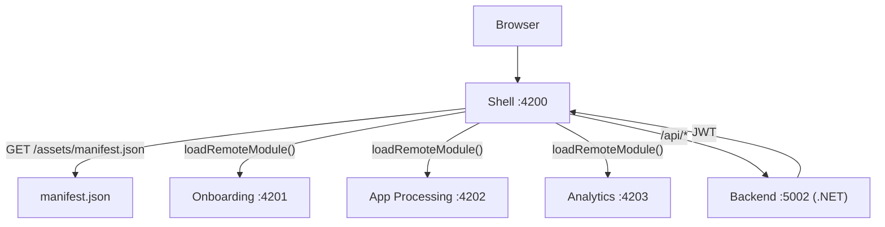
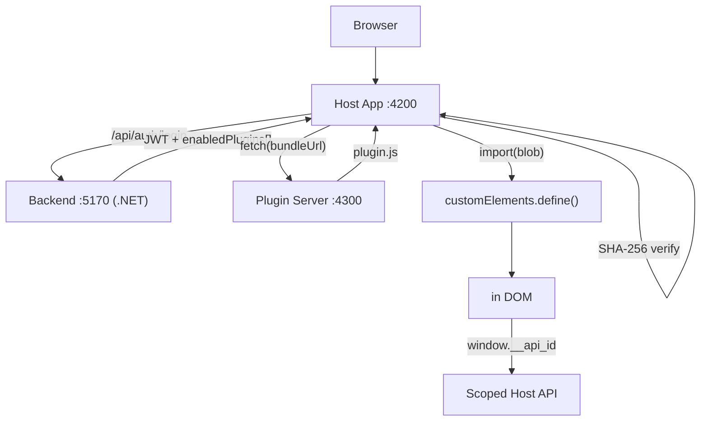

# Platform UI Overhaul — Implementation Plan

> **For agentic workers:** REQUIRED SUB-SKILL: Use superpowers:subagent-driven-development (recommended) or superpowers:executing-plans to implement this plan task-by-task. Steps use checkbox (`- [ ]`) syntax for tracking.

**Goal:** Redesign both projects with professional UI, 3-theme switcher, MFE error handling, neutral terminology, and full documentation.

**Architecture:** CSS custom properties on `<html>` driven by a `ThemeService` (one per project). Angular `@if` switches between sidebar and top-nav DOM layouts. MFE unavailability caught in `ManifestService` and rendered as a fallback component.

**Tech Stack:** Angular 21, SCSS, CSS custom properties, Vitest, standalone components, Angular signals.

## Global Constraints
- Brand name in UI: "Platform" (never "Banking", "Bank", "bank", "BANK01")
- Tenant hint in UI: "ORG01" (not "BANK01")
- Role labels in UI only: CUSTOMER→USER, TELLER→MEMBER, PLATFORM_ADMIN→ADMIN
- CSS variable names: `--bg-primary`, `--bg-surface`, `--bg-nav`, `--text-primary`, `--text-secondary`, `--text-nav`, `--accent`, `--accent-hover`, `--border`, `--shadow`
- Theme classes on `<html>`: `theme-dark` (default), `theme-topnav`, `theme-minimal`
- localStorage key: `"pp-theme"`
- No backend changes
- Follow existing inline-style pattern; replace colour literals with `var(--token)`
- Tasks 1–7: microfrontend project (`d:\AI_ML\RND\microfrontend\microfrontend\`)
- Tasks 8–12: plugin-platform project (`d:\AI_ML\RND\microfrontend\plugin-platform\`)
- Tasks 13–15: documentation
- Tasks 1–7 and 8–12 are independent and can run in parallel

---

## File Map

**Microfrontend**
- Create: `shell/src/app/core/theme.service.ts`
- Create: `shell/src/app/core/theme.service.spec.ts`
- Create: `shell/src/app/core/unavailable-module.component.ts`
- Modify: `shell/src/styles.scss`
- Modify: `shell/src/app/app.ts`
- Modify: `shell/src/app/features/login/login.component.ts`
- Modify: `shell/src/app/core/manifest.service.ts`
- Modify: `apps/onboarding/src/app/app.ts`
- Modify: `apps/los/src/app/app.ts`
- Modify: `apps/reporting/src/app/app.ts`

**Plugin-platform**
- Create: `host-app/src/app/core/theme.service.ts`
- Create: `host-app/src/app/core/theme.service.spec.ts`
- Modify: `host-app/src/styles.scss`
- Modify: `host-app/src/app/app.ts`
- Modify: `host-app/src/app/features/login/login.component.ts`
- Modify: `host-app/src/app/features/dashboard/dashboard.component.ts`
- Modify: `host-app/src/app/features/admin/marketplace/admin-marketplace.component.ts`
- Modify: `host-app/src/app/features/vendor/submit-plugin/submit-plugin.component.ts`
- Modify: `host-app/src/app/features/admin/tenant-plugins/tenant-plugins.component.ts`

**Docs**
- Create: `microfrontend/README.md`
- Create: `plugin-platform/README.md`
- Create: `COMPARISON.md` (repo root `d:\AI_ML\RND\microfrontend\`)

---

## Task 1: Shell — CSS Variables + ThemeService

**Files:**
- Modify: `shell/src/styles.scss`
- Create: `shell/src/app/core/theme.service.ts`
- Create: `shell/src/app/core/theme.service.spec.ts`

**Interfaces:**
- Produces: `ThemeService` with `theme: Signal<'dark'|'topnav'|'minimal'>` and `cycle(): void`

- [ ] **Step 1: Replace `shell/src/styles.scss` entirely**

```scss
:root, .theme-dark {
  --bg-primary: #0f1117;
  --bg-surface: #1a1d27;
  --bg-nav: #13151e;
  --text-primary: #e2e8f0;
  --text-secondary: #64748b;
  --text-nav: #94a3b8;
  --accent: #6366f1;
  --accent-hover: #4f46e5;
  --border: #2d3148;
  --shadow: 0 2px 8px rgba(0,0,0,0.4);
}
.theme-topnav {
  --bg-primary: #f0f4f8;
  --bg-surface: #ffffff;
  --bg-nav: #1e40af;
  --text-primary: #1e293b;
  --text-secondary: #64748b;
  --text-nav: #e0f2fe;
  --accent: #3b82f6;
  --accent-hover: #2563eb;
  --border: #e2e8f0;
  --shadow: 0 2px 8px rgba(0,0,0,0.08);
}
.theme-minimal {
  --bg-primary: #ffffff;
  --bg-surface: #fafafa;
  --bg-nav: #ffffff;
  --text-primary: #111827;
  --text-secondary: #6b7280;
  --text-nav: #374151;
  --accent: #6366f1;
  --accent-hover: #4f46e5;
  --border: #e5e7eb;
  --shadow: 0 1px 3px rgba(0,0,0,0.06);
}
*, *::before, *::after { box-sizing: border-box; }
body {
  margin: 0;
  font-family: 'Inter', -apple-system, BlinkMacSystemFont, 'Segoe UI', sans-serif;
  background: var(--bg-primary);
  color: var(--text-primary);
  transition: background 0.2s ease, color 0.2s ease;
}
a { color: inherit; }
input, button, select { font-family: inherit; }
```

- [ ] **Step 2: Create `shell/src/app/core/theme.service.ts`**

```typescript
import { Injectable, signal } from '@angular/core';

export type Theme = 'dark' | 'topnav' | 'minimal';
const THEMES: Theme[] = ['dark', 'topnav', 'minimal'];
const KEY = 'pp-theme';

@Injectable({ providedIn: 'root' })
export class ThemeService {
  private readonly _theme = signal<Theme>(this.load());
  readonly theme = this._theme.asReadonly();

  constructor() { this.apply(this._theme()); }

  cycle(): void {
    const next = THEMES[(THEMES.indexOf(this._theme()) + 1) % THEMES.length];
    this._theme.set(next);
    localStorage.setItem(KEY, next);
    this.apply(next);
  }

  private load(): Theme {
    const saved = localStorage.getItem(KEY) as Theme;
    return THEMES.includes(saved) ? saved : 'dark';
  }

  private apply(theme: Theme): void {
    const html = document.documentElement;
    THEMES.forEach(t => html.classList.remove(`theme-${t}`));
    html.classList.add(`theme-${theme}`);
  }
}
```

- [ ] **Step 3: Create `shell/src/app/core/theme.service.spec.ts`**

```typescript
import { describe, it, expect, beforeEach } from 'vitest';

const THEMES = ['dark', 'topnav', 'minimal'] as const;
type Theme = typeof THEMES[number];

function nextTheme(current: Theme): Theme {
  return THEMES[(THEMES.indexOf(current) + 1) % THEMES.length];
}

describe('theme cycling logic', () => {
  it('dark -> topnav', () => expect(nextTheme('dark')).toBe('topnav'));
  it('topnav -> minimal', () => expect(nextTheme('topnav')).toBe('minimal'));
  it('minimal -> dark', () => expect(nextTheme('minimal')).toBe('dark'));
});
```

- [ ] **Step 4: Run tests**

```powershell
cd "d:\AI_ML\RND\microfrontend\microfrontend\shell"
npx vitest run src/app/core/theme.service.spec.ts
```
Expected: 3 tests pass.

- [ ] **Step 5: Commit**
```bash
git -C "d:\AI_ML\RND\microfrontend" add microfrontend/shell/src/styles.scss microfrontend/shell/src/app/core/theme.service.ts microfrontend/shell/src/app/core/theme.service.spec.ts
git -C "d:\AI_ML\RND\microfrontend" commit -m "feat(shell): add CSS variable theme system and ThemeService"
```

---

## Task 2: Shell — Adaptive Nav + Theme Toggle

**Files:**
- Modify: `shell/src/app/app.ts`

**Interfaces:**
- Consumes: `ThemeService.theme`, `ThemeService.cycle()`, `AuthService.isAuthenticated`, `AuthService.currentUser`, `AuthService.logout()`

- [ ] **Step 1: Replace `shell/src/app/app.ts` entirely**

```typescript
import { Component, inject } from '@angular/core';
import { RouterOutlet, RouterLink, RouterLinkActive } from '@angular/router';
import { AuthService } from 'shared-auth';
import { ThemeService } from './core/theme.service';

const ICONS: Record<string, string> = { dark: '🌙', topnav: '⊞', minimal: '○' };
const NAV_LINKS = [
  { path: '/onboarding', label: 'Onboarding' },
  { path: '/los', label: 'App Processing' },
  { path: '/reporting', label: 'Analytics' },
];

@Component({
  selector: 'app-root',
  standalone: true,
  imports: [RouterOutlet, RouterLink, RouterLinkActive],
  template: `
    @if (auth.isAuthenticated()) {
      @if (theme.theme() === 'dark') {
        <!-- DARK SIDEBAR LAYOUT -->
        <div style="display:flex;min-height:100vh">
          <aside style="width:220px;min-height:100vh;background:var(--bg-nav);display:flex;flex-direction:column;position:fixed;top:0;left:0;bottom:0;z-index:100">
            <div style="padding:24px 20px 16px;border-bottom:1px solid var(--border)">
              <div style="display:flex;align-items:center;gap:10px">
                <svg width="24" height="24" viewBox="0 0 24 24" fill="none">
                  <rect x="2" y="2" width="9" height="9" rx="2" fill="var(--accent)"/>
                  <rect x="13" y="2" width="9" height="9" rx="2" fill="var(--accent)" opacity="0.5"/>
                  <rect x="2" y="13" width="9" height="9" rx="2" fill="var(--accent)" opacity="0.5"/>
                  <rect x="13" y="13" width="9" height="9" rx="2" fill="var(--accent)"/>
                </svg>
                <span style="color:var(--text-primary);font-weight:700;font-size:16px;letter-spacing:-0.3px">Platform</span>
              </div>
            </div>
            <nav style="flex:1;padding:16px 12px;display:flex;flex-direction:column;gap:4px">
              @for (link of navLinks; track link.path) {
                <a [routerLink]="link.path" routerLinkActive="sidebar-active"
                   style="display:block;padding:10px 12px;border-radius:6px;color:var(--text-nav);text-decoration:none;font-size:14px;font-weight:500;transition:background 0.15s,color 0.15s">
                  {{ link.label }}
                </a>
              }
            </nav>
            <div style="padding:16px 12px;border-top:1px solid var(--border)">
              <div style="color:var(--text-primary);font-size:13px;font-weight:500;margin-bottom:4px">{{ auth.currentUser()?.fullName }}</div>
              <div style="color:var(--text-secondary);font-size:12px;margin-bottom:12px">{{ roleLabel(auth.currentUser()?.role) }}</div>
              <button (click)="logout()" style="width:100%;background:transparent;border:1px solid var(--border);color:var(--text-nav);padding:8px;border-radius:6px;cursor:pointer;font-size:13px">Sign out</button>
            </div>
          </aside>
          <main style="flex:1;margin-left:220px;background:var(--bg-primary);min-height:100vh">
            <router-outlet />
          </main>
        </div>
      } @else {
        <!-- TOP NAV LAYOUT (topnav + minimal) -->
        <div>
          <header style="position:fixed;top:0;left:0;right:0;height:56px;background:var(--bg-nav);border-bottom:1px solid var(--border);display:flex;align-items:center;padding:0 24px;gap:24px;z-index:100;box-shadow:var(--shadow)">
            <div style="display:flex;align-items:center;gap:8px;margin-right:16px">
              <svg width="20" height="20" viewBox="0 0 24 24" fill="none">
                <rect x="2" y="2" width="9" height="9" rx="2" fill="var(--accent)"/>
                <rect x="13" y="2" width="9" height="9" rx="2" fill="var(--accent)" opacity="0.5"/>
                <rect x="2" y="13" width="9" height="9" rx="2" fill="var(--accent)" opacity="0.5"/>
                <rect x="13" y="13" width="9" height="9" rx="2" fill="var(--accent)"/>
              </svg>
              <span style="color:var(--text-nav);font-weight:700;font-size:15px">Platform</span>
            </div>
            @for (link of navLinks; track link.path) {
              <a [routerLink]="link.path" routerLinkActive="topnav-active"
                 style="color:var(--text-nav);text-decoration:none;font-size:14px;font-weight:500;padding:6px 2px;border-bottom:2px solid transparent;transition:border-color 0.15s,color 0.15s">
                {{ link.label }}
              </a>
            }
            <span style="flex:1"></span>
            <span style="color:var(--text-nav);font-size:13px;font-weight:500">{{ auth.currentUser()?.fullName }}</span>
            <span style="background:var(--accent);color:white;font-size:11px;padding:2px 8px;border-radius:999px;font-weight:600">{{ roleLabel(auth.currentUser()?.role) }}</span>
            <button (click)="logout()" style="background:transparent;border:1px solid var(--text-nav);color:var(--text-nav);padding:6px 14px;border-radius:6px;cursor:pointer;font-size:13px">Sign out</button>
          </header>
          <main style="padding-top:56px;background:var(--bg-primary);min-height:100vh">
            <router-outlet />
          </main>
        </div>
      }
    } @else {
      <div style="background:var(--bg-primary);min-height:100vh">
        <router-outlet />
      </div>
    }
    <!-- floating theme toggle -->
    <button (click)="theme.cycle()" title="Switch theme"
      style="position:fixed;bottom:24px;right:24px;width:44px;height:44px;border-radius:50%;background:var(--accent);color:white;border:none;cursor:pointer;font-size:18px;display:flex;align-items:center;justify-content:center;box-shadow:var(--shadow);z-index:200;transition:background 0.2s">
      {{ themeIcon() }}
    </button>
    <style>
      .sidebar-active { background: var(--accent) !important; color: white !important; }
      .topnav-active { border-bottom-color: var(--accent) !important; color: var(--accent) !important; }
    </style>
  `
})
export class App {
  readonly auth = inject(AuthService);
  readonly theme = inject(ThemeService);
  readonly navLinks = NAV_LINKS;

  themeIcon(): string { return ICONS[this.theme.theme()]; }

  roleLabel(role?: string): string {
    const map: Record<string, string> = { CUSTOMER: 'USER', TELLER: 'MEMBER', PLATFORM_ADMIN: 'ADMIN', ADMIN: 'ADMIN' };
    return role ? (map[role] ?? role) : '';
  }

  logout(): void { this.auth.logout().subscribe(); }
}
```

- [ ] **Step 2: Verify in browser**

Start shell: `cd microfrontend/shell && ng serve`
- Login → nav appears with Onboarding / App Processing / Analytics
- Theme toggle button bottom-right cycles through 3 layouts
- Sidebar appears in dark mode, top bar in topnav/minimal
- Sign out returns to login

- [ ] **Step 3: Commit**
```bash
git -C "d:\AI_ML\RND\microfrontend" add microfrontend/shell/src/app/app.ts
git -C "d:\AI_ML\RND\microfrontend" commit -m "feat(shell): adaptive 3-theme nav with logout and theme toggle"
```

---

## Task 3: Shell — Login Redesign

**Files:**
- Modify: `shell/src/app/features/login/login.component.ts`

- [ ] **Step 1: Replace login component entirely**

```typescript
import { Component, inject, signal } from '@angular/core';
import { FormsModule } from '@angular/forms';
import { Router } from '@angular/router';
import { AuthService } from 'shared-auth';

@Component({
  selector: 'app-login',
  standalone: true,
  imports: [FormsModule],
  template: `
    <div style="min-height:100vh;background:var(--bg-primary);display:flex;align-items:center;justify-content:center;padding:24px">
      <div style="width:100%;max-width:400px">
        <!-- logo + wordmark -->
        <div style="display:flex;align-items:center;gap:10px;margin-bottom:32px;justify-content:center">
          <svg width="32" height="32" viewBox="0 0 24 24" fill="none">
            <rect x="2" y="2" width="9" height="9" rx="2" fill="var(--accent)"/>
            <rect x="13" y="2" width="9" height="9" rx="2" fill="var(--accent)" opacity="0.5"/>
            <rect x="2" y="13" width="9" height="9" rx="2" fill="var(--accent)" opacity="0.5"/>
            <rect x="13" y="13" width="9" height="9" rx="2" fill="var(--accent)"/>
          </svg>
          <span style="font-size:24px;font-weight:700;color:var(--text-primary);letter-spacing:-0.5px">Platform</span>
        </div>
        <!-- card -->
        <div style="background:var(--bg-surface);border-radius:12px;box-shadow:var(--shadow);border:1px solid var(--border);overflow:hidden">
          <div style="height:4px;background:var(--accent)"></div>
          <div style="padding:32px">
            <h1 style="margin:0 0 6px;font-size:22px;font-weight:700;color:var(--text-primary)">Welcome back</h1>
            <p style="margin:0 0 28px;font-size:14px;color:var(--text-secondary)">Sign in to your account to continue</p>

            @if (errorMessage()) {
              <div style="background:#fef2f2;border:1px solid #fecaca;color:#dc2626;padding:10px 14px;border-radius:6px;font-size:13px;margin-bottom:20px">
                {{ errorMessage() }}
              </div>
            }

            <form (ngSubmit)="onSubmit()" style="display:flex;flex-direction:column;gap:16px">
              <div>
                <label style="display:block;font-size:13px;font-weight:500;color:var(--text-secondary);margin-bottom:6px">Username</label>
                <input type="text" [(ngModel)]="username" name="username" required autocomplete="username"
                  style="width:100%;padding:10px 14px;border:1px solid var(--border);border-radius:6px;background:var(--bg-primary);color:var(--text-primary);font-size:14px;outline:none;transition:border-color 0.15s"
                  placeholder="Enter your username" />
              </div>
              <div>
                <label style="display:block;font-size:13px;font-weight:500;color:var(--text-secondary);margin-bottom:6px">Password</label>
                <input type="password" [(ngModel)]="password" name="password" required autocomplete="current-password"
                  style="width:100%;padding:10px 14px;border:1px solid var(--border);border-radius:6px;background:var(--bg-primary);color:var(--text-primary);font-size:14px;outline:none;transition:border-color 0.15s"
                  placeholder="Enter your password" />
              </div>
              <button type="submit" [disabled]="loading()"
                style="width:100%;padding:11px;background:var(--accent);color:white;border:none;border-radius:6px;font-size:14px;font-weight:600;cursor:pointer;transition:background 0.15s;margin-top:4px">
                {{ loading() ? 'Signing in…' : 'Sign In' }}
              </button>
            </form>

            <!-- demo credentials collapsible -->
            <details style="margin-top:20px">
              <summary style="font-size:12px;color:var(--text-secondary);cursor:pointer;user-select:none">Demo credentials</summary>
              <div style="margin-top:10px;padding:12px;background:var(--bg-primary);border-radius:6px;border:1px solid var(--border);font-size:12px;color:var(--text-secondary)">
                <div style="margin-bottom:6px"><strong style="color:var(--text-primary)">teller1</strong> / pass123 — Member</div>
                <div><strong style="color:var(--text-primary)">admin1</strong> / pass123 — Admin</div>
              </div>
            </details>
          </div>
        </div>
      </div>
    </div>
  `
})
export class LoginComponent {
  private readonly auth = inject(AuthService);
  private readonly router = inject(Router);

  username = '';
  password = '';
  loading = signal(false);
  errorMessage = signal('');

  onSubmit(): void {
    this.loading.set(true);
    this.errorMessage.set('');
    this.auth.login({ username: this.username, password: this.password }).subscribe({
      next: () => this.router.navigate(['/']),
      error: () => { this.errorMessage.set('Invalid username or password.'); this.loading.set(false); }
    });
  }
}
```

- [ ] **Step 2: Verify**
Navigate to `http://localhost:4200` — card-based login with accent bar, demo credentials collapsible, error banner on bad credentials.

- [ ] **Step 3: Commit**
```bash
git -C "d:\AI_ML\RND\microfrontend" add microfrontend/shell/src/app/features/login/login.component.ts
git -C "d:\AI_ML\RND\microfrontend" commit -m "feat(shell): professional login page redesign"
```

---

## Task 4: Shell — MFE Unavailability Card

**Files:**
- Create: `shell/src/app/core/unavailable-module.component.ts`
- Modify: `shell/src/app/core/manifest.service.ts`

**Interfaces:**
- Produces: `UnavailableModuleComponent` (standalone, input `moduleName: string`)
- Consumes: `loadRemoteModule` from `@angular-architects/native-federation`

- [ ] **Step 1: Create `shell/src/app/core/unavailable-module.component.ts`**

```typescript
import { Component, input } from '@angular/core';

@Component({
  selector: 'app-unavailable-module',
  standalone: true,
  template: `
    <div style="padding:40px;display:flex;justify-content:center">
      <div style="max-width:480px;width:100%;background:var(--bg-surface);border:1px solid var(--border);border-radius:12px;padding:40px;text-align:center">
        <div style="font-size:40px;margin-bottom:16px">⚠️</div>
        <h2 style="margin:0 0 8px;font-size:18px;font-weight:600;color:var(--text-primary)">{{ moduleName() }} Unavailable</h2>
        <p style="margin:0 0 24px;font-size:14px;color:var(--text-secondary);line-height:1.5">
          This module is currently unavailable. Please ensure the service is running and try again.
        </p>
        <button (click)="retry()"
          style="background:var(--accent);color:white;border:none;padding:10px 24px;border-radius:6px;font-size:14px;font-weight:500;cursor:pointer">
          Retry
        </button>
      </div>
    </div>
  `
})
export class UnavailableModuleComponent {
  readonly moduleName = input<string>('Module');
  retry(): void { window.location.reload(); }
}
```

- [ ] **Step 2: Update `shell/src/app/core/manifest.service.ts`**

```typescript
import { Injectable, inject } from '@angular/core';
import { HttpClient } from '@angular/common/http';
import { Router, Routes } from '@angular/router';
import { Observable, from, switchMap, tap } from 'rxjs';
import { loadRemoteModule } from '@angular-architects/native-federation';
import { AuthGuard } from 'shared-auth';
import { UnavailableModuleComponent } from './unavailable-module.component';

@Injectable({ providedIn: 'root' })
export class ManifestService {
  private readonly http = inject(HttpClient);
  private readonly router = inject(Router);

  loadAndRegisterRoutes(): Observable<void> {
    return this.http.get<Record<string, string>>('/assets/manifest.json').pipe(
      tap(manifest => {
        const appNames = Object.keys(manifest);
        const dynamicRoutes: Routes = appNames.map(appName => ({
          path: appName,
          canActivate: [AuthGuard],
          loadComponent: () =>
            loadRemoteModule(appName, './Component')
              .then(m => m.AppComponent)
              .catch(() => {
                // Return a component factory that renders the unavailable card
                const name = appName.charAt(0).toUpperCase() + appName.slice(1);
                @Component({
                  standalone: true,
                  imports: [UnavailableModuleComponent],
                  template: `<app-unavailable-module moduleName="${name}" />`
                })
                class FallbackComponent {}
                return FallbackComponent;
              })
        }));

        const defaultApp = appNames[0] ?? 'login';
        this.router.resetConfig([
          ...dynamicRoutes,
          { path: 'login', loadComponent: () => import('../features/login/login.component').then(m => m.LoginComponent) },
          { path: '', redirectTo: `/${defaultApp}`, pathMatch: 'full' as const },
          { path: '**', redirectTo: `/${defaultApp}` }
        ]);
      }),
      switchMap(() => from(Promise.resolve()))
    );
  }
}
```

- [ ] **Step 3: Verify**
Stop one MFE (e.g. kill LOS on port 4202), navigate to `/los` — see the unavailability card with module name and Retry button. Restart LOS, click Retry — module loads.

- [ ] **Step 4: Commit**
```bash
git -C "d:\AI_ML\RND\microfrontend" add microfrontend/shell/src/app/core/unavailable-module.component.ts microfrontend/shell/src/app/core/manifest.service.ts
git -C "d:\AI_ML\RND\microfrontend" commit -m "feat(shell): MFE unavailability fallback card with retry"
```

---

## Task 5: MFE — Client Onboarding Redesign

**Files:**
- Modify: `apps/onboarding/src/app/app.ts`

- [ ] **Step 1: Replace `apps/onboarding/src/app/app.ts`**

```typescript
import { Component } from '@angular/core';

@Component({
  selector: 'app-onboarding-root',
  standalone: true,
  template: `
    <div style="padding:32px;background:var(--bg-primary);min-height:100vh">
      <div style="max-width:720px;margin:0 auto">
        <!-- header -->
        <div style="display:flex;align-items:center;justify-content:space-between;margin-bottom:32px">
          <div>
            <h1 style="margin:0 0 4px;font-size:24px;font-weight:700;color:var(--text-primary)">Client Onboarding</h1>
            <p style="margin:0;font-size:14px;color:var(--text-secondary)">Complete all steps to activate a new client account</p>
          </div>
          <span style="background:var(--accent);color:white;font-size:11px;padding:4px 10px;border-radius:999px;font-weight:600;letter-spacing:0.5px">COMING SOON</span>
        </div>

        <!-- stepper -->
        <div style="display:flex;align-items:center;gap:0;margin-bottom:32px">
          @for (step of steps; track step.n; let last = $last) {
            <div style="display:flex;align-items:center;flex:1">
              <div style="display:flex;align-items:center;gap:10px">
                <div [style]="stepCircle(step.n)"
                  style="width:32px;height:32px;border-radius:50%;display:flex;align-items:center;justify-content:center;font-size:13px;font-weight:600;flex-shrink:0">
                  {{ step.n }}
                </div>
                <span [style]="stepLabel(step.n)" style="font-size:13px;font-weight:500;white-space:nowrap">{{ step.label }}</span>
              </div>
              @if (!last) {
                <div style="flex:1;height:1px;background:var(--border);margin:0 12px"></div>
              }
            </div>
          }
        </div>

        <!-- step content card -->
        <div style="background:var(--bg-surface);border:1px solid var(--border);border-radius:12px;padding:32px;box-shadow:var(--shadow)">
          <h2 style="margin:0 0 24px;font-size:18px;font-weight:600;color:var(--text-primary)">Step 1: Client Profile</h2>
          <div style="display:grid;grid-template-columns:1fr 1fr;gap:20px">
            @for (field of fields; track field.label) {
              <div [style]="field.full ? 'grid-column:1/-1' : ''">
                <label style="display:block;font-size:12px;font-weight:500;color:var(--text-secondary);margin-bottom:6px;text-transform:uppercase;letter-spacing:0.5px">{{ field.label }}</label>
                <input [type]="field.type" [placeholder]="field.placeholder" disabled
                  style="width:100%;padding:10px 14px;border:1px solid var(--border);border-radius:6px;background:var(--bg-primary);color:var(--text-secondary);font-size:14px;cursor:not-allowed;opacity:0.7" />
              </div>
            }
          </div>
          <div style="display:flex;justify-content:flex-end;gap:12px;margin-top:28px;padding-top:24px;border-top:1px solid var(--border)">
            <button disabled style="padding:10px 20px;border:1px solid var(--border);border-radius:6px;background:transparent;color:var(--text-secondary);font-size:14px;cursor:not-allowed">Previous</button>
            <button disabled style="padding:10px 20px;background:var(--accent);color:white;border:none;border-radius:6px;font-size:14px;font-weight:500;cursor:not-allowed;opacity:0.6">Next Step →</button>
          </div>
        </div>
      </div>
    </div>
  `
})
export class App {
  readonly steps = [
    { n: 1, label: 'Profile' },
    { n: 2, label: 'Documents' },
    { n: 3, label: 'Review' }
  ];

  readonly fields = [
    { label: 'Full Name', type: 'text', placeholder: 'e.g. Jane Doe', full: false },
    { label: 'Email Address', type: 'email', placeholder: 'e.g. jane@example.com', full: false },
    { label: 'Phone Number', type: 'tel', placeholder: '+1 (555) 000-0000', full: false },
    { label: 'Date of Birth', type: 'date', placeholder: '', full: false },
    { label: 'Residential Address', type: 'text', placeholder: 'Street address', full: true },
    { label: 'Organization / Company', type: 'text', placeholder: 'Optional', full: false },
    { label: 'Account Type', type: 'text', placeholder: 'Standard / Premium', full: false },
  ];

  stepCircle(n: number): string {
    return n === 1
      ? 'background:var(--accent);color:white;'
      : 'background:var(--bg-primary);color:var(--text-secondary);border:1px solid var(--border);';
  }

  stepLabel(n: number): string {
    return n === 1 ? 'color:var(--text-primary);' : 'color:var(--text-secondary);';
  }
}

export { App as AppComponent };
```

- [ ] **Step 2: Verify** — Navigate to `/onboarding`: stepper, disabled form fields, Coming Soon badge visible.

- [ ] **Step 3: Commit**
```bash
git -C "d:\AI_ML\RND\microfrontend" add microfrontend/apps/onboarding/src/app/app.ts
git -C "d:\AI_ML\RND\microfrontend" commit -m "feat(onboarding): professional wizard UI redesign"
```

---

## Task 6: MFE — Application Processing Redesign (was LOS)

**Files:**
- Modify: `apps/los/src/app/app.ts`

- [ ] **Step 1: Replace `apps/los/src/app/app.ts`**

```typescript
import { Component } from '@angular/core';

interface Application {
  id: string; applicant: string; type: string; submitted: string;
  status: 'Pending' | 'In Review' | 'Approved' | 'Rejected';
}

@Component({
  selector: 'app-los-root',
  standalone: true,
  template: `
    <div style="padding:32px;background:var(--bg-primary);min-height:100vh">
      <div style="max-width:900px;margin:0 auto">
        <!-- header -->
        <div style="display:flex;align-items:center;justify-content:space-between;margin-bottom:28px">
          <div>
            <h1 style="margin:0 0 4px;font-size:24px;font-weight:700;color:var(--text-primary)">Application Processing</h1>
            <p style="margin:0;font-size:14px;color:var(--text-secondary)">Review and manage submitted applications</p>
          </div>
          <button disabled style="padding:10px 18px;background:var(--accent);color:white;border:none;border-radius:6px;font-size:14px;font-weight:500;cursor:not-allowed;opacity:0.7">+ New Application</button>
        </div>

        <!-- stat pills -->
        <div style="display:flex;gap:12px;margin-bottom:28px;flex-wrap:wrap">
          @for (stat of stats; track stat.label) {
            <div style="background:var(--bg-surface);border:1px solid var(--border);border-radius:8px;padding:14px 20px;min-width:120px">
              <div style="font-size:22px;font-weight:700;color:var(--text-primary)">{{ stat.value }}</div>
              <div style="font-size:12px;color:var(--text-secondary);margin-top:2px">{{ stat.label }}</div>
            </div>
          }
        </div>

        <!-- table -->
        <div style="background:var(--bg-surface);border:1px solid var(--border);border-radius:12px;overflow:hidden;box-shadow:var(--shadow)">
          <table style="width:100%;border-collapse:collapse">
            <thead>
              <tr style="background:var(--bg-primary);border-bottom:1px solid var(--border)">
                <th style="padding:12px 20px;text-align:left;font-size:12px;font-weight:600;color:var(--text-secondary);text-transform:uppercase;letter-spacing:0.5px">ID</th>
                <th style="padding:12px 20px;text-align:left;font-size:12px;font-weight:600;color:var(--text-secondary);text-transform:uppercase;letter-spacing:0.5px">Applicant</th>
                <th style="padding:12px 20px;text-align:left;font-size:12px;font-weight:600;color:var(--text-secondary);text-transform:uppercase;letter-spacing:0.5px">Type</th>
                <th style="padding:12px 20px;text-align:left;font-size:12px;font-weight:600;color:var(--text-secondary);text-transform:uppercase;letter-spacing:0.5px">Submitted</th>
                <th style="padding:12px 20px;text-align:left;font-size:12px;font-weight:600;color:var(--text-secondary);text-transform:uppercase;letter-spacing:0.5px">Status</th>
              </tr>
            </thead>
            <tbody>
              @for (app of applications; track app.id; let odd = $odd) {
                <tr [style]="odd ? 'background:var(--bg-primary)' : ''">
                  <td style="padding:14px 20px;font-size:13px;color:var(--text-secondary);font-family:monospace">{{ app.id }}</td>
                  <td style="padding:14px 20px;font-size:14px;color:var(--text-primary);font-weight:500">{{ app.applicant }}</td>
                  <td style="padding:14px 20px;font-size:13px;color:var(--text-secondary)">{{ app.type }}</td>
                  <td style="padding:14px 20px;font-size:13px;color:var(--text-secondary)">{{ app.submitted }}</td>
                  <td style="padding:14px 20px"><span [style]="badgeStyle(app.status)" style="font-size:12px;padding:3px 10px;border-radius:999px;font-weight:600">{{ app.status }}</span></td>
                </tr>
              }
            </tbody>
          </table>
        </div>
      </div>
    </div>
  `
})
export class App {
  readonly stats = [
    { value: '24', label: 'Total' },
    { value: '8', label: 'Pending' },
    { value: '11', label: 'In Review' },
    { value: '5', label: 'Approved' },
  ];

  readonly applications: Application[] = [
    { id: 'APP-0041', applicant: 'Sarah Mitchell', type: 'Personal', submitted: '2026-06-18', status: 'In Review' },
    { id: 'APP-0040', applicant: 'James Okafor', type: 'Business', submitted: '2026-06-17', status: 'Pending' },
    { id: 'APP-0039', applicant: 'Priya Sharma', type: 'Personal', submitted: '2026-06-15', status: 'Approved' },
    { id: 'APP-0038', applicant: 'Carlos Reyes', type: 'Enterprise', submitted: '2026-06-14', status: 'Rejected' },
  ];

  badgeStyle(status: string): string {
    const map: Record<string, string> = {
      Pending:   'background:#fef3c7;color:#92400e;',
      'In Review': 'background:#dbeafe;color:#1e40af;',
      Approved:  'background:#d1fae5;color:#065f46;',
      Rejected:  'background:#fee2e2;color:#991b1b;',
    };
    return map[status] ?? '';
  }
}

export { App as AppComponent };
```

- [ ] **Step 2: Verify** — Navigate to `/los`: table with 4 rows, colour-coded status badges, stat pills above.

- [ ] **Step 3: Commit**
```bash
git -C "d:\AI_ML\RND\microfrontend" add microfrontend/apps/los/src/app/app.ts
git -C "d:\AI_ML\RND\microfrontend" commit -m "feat(los): Application Processing redesign with status table"
```

---

## Task 7: MFE — Analytics & Reports Redesign

**Files:**
- Modify: `apps/reporting/src/app/app.ts`

- [ ] **Step 1: Replace `apps/reporting/src/app/app.ts`**

```typescript
import { Component } from '@angular/core';

@Component({
  selector: 'app-reporting-root',
  standalone: true,
  template: `
    <div style="padding:32px;background:var(--bg-primary);min-height:100vh">
      <div style="max-width:900px;margin:0 auto">
        <div style="margin-bottom:28px">
          <h1 style="margin:0 0 4px;font-size:24px;font-weight:700;color:var(--text-primary)">Analytics & Reports</h1>
          <p style="margin:0;font-size:14px;color:var(--text-secondary)">Platform metrics — last 30 days</p>
        </div>

        <!-- metric cards -->
        <div style="display:grid;grid-template-columns:repeat(3,1fr);gap:20px;margin-bottom:32px">
          @for (metric of metrics; track metric.label) {
            <div style="background:var(--bg-surface);border:1px solid var(--border);border-radius:12px;padding:24px;box-shadow:var(--shadow)">
              <div style="font-size:12px;font-weight:500;color:var(--text-secondary);text-transform:uppercase;letter-spacing:0.5px;margin-bottom:8px">{{ metric.label }}</div>
              <div style="font-size:32px;font-weight:700;color:var(--text-primary);margin-bottom:6px">{{ metric.value }}</div>
              <div [style]="metric.up ? 'color:#10b981' : 'color:#ef4444'" style="font-size:12px;font-weight:500">
                {{ metric.up ? '↑' : '↓' }} {{ metric.trend }} vs last period
              </div>
            </div>
          }
        </div>

        <!-- bar chart -->
        <div style="background:var(--bg-surface);border:1px solid var(--border);border-radius:12px;padding:28px;box-shadow:var(--shadow)">
          <h2 style="margin:0 0 24px;font-size:16px;font-weight:600;color:var(--text-primary)">Weekly Activity</h2>
          <div style="display:flex;align-items:flex-end;gap:16px;height:140px">
            @for (bar of bars; track bar.day) {
              <div style="flex:1;display:flex;flex-direction:column;align-items:center;gap:6px">
                <span style="font-size:11px;color:var(--text-secondary)">{{ bar.value }}</span>
                <div [style]="'height:' + bar.pct + '%;background:var(--accent);border-radius:4px 4px 0 0;width:100%;min-height:4px;opacity:' + (bar.today ? '1' : '0.55')"></div>
                <span style="font-size:11px;color:var(--text-secondary)">{{ bar.day }}</span>
              </div>
            }
          </div>
        </div>
      </div>
    </div>
  `
})
export class App {
  readonly metrics = [
    { label: 'Total Users', value: '1,284', trend: '12%', up: true },
    { label: 'Active Sessions', value: '47', trend: '3%', up: false },
    { label: 'Completion Rate', value: '73%', trend: '8%', up: true },
  ];

  readonly bars = [
    { day: 'Mon', value: 38, pct: 54, today: false },
    { day: 'Tue', value: 52, pct: 74, today: false },
    { day: 'Wed', value: 61, pct: 87, today: false },
    { day: 'Thu', value: 45, pct: 64, today: false },
    { day: 'Fri', value: 70, pct: 100, today: false },
    { day: 'Sat', value: 29, pct: 41, today: false },
    { day: 'Sun', value: 47, pct: 67, today: true },
  ];
}

export { App as AppComponent };
```

- [ ] **Step 2: Verify** — Navigate to `/reporting`: 3 metric cards with trend indicators, CSS bar chart with 7 days.

- [ ] **Step 3: Commit**
```bash
git -C "d:\AI_ML\RND\microfrontend" add microfrontend/apps/reporting/src/app/app.ts
git -C "d:\AI_ML\RND\microfrontend" commit -m "feat(reporting): Analytics & Reports redesign with metrics and chart"
```

---

## Task 8: Plugin-Platform — CSS Variables + ThemeService

**Files:**
- Modify: `plugin-platform/host-app/src/styles.scss`
- Create: `plugin-platform/host-app/src/app/core/theme.service.ts`
- Create: `plugin-platform/host-app/src/app/core/theme.service.spec.ts`

- [ ] **Step 1: Check if `host-app/src/styles.scss` exists, then replace**

```scss
:root, .theme-dark {
  --bg-primary: #0f1117;
  --bg-surface: #1a1d27;
  --bg-nav: #13151e;
  --text-primary: #e2e8f0;
  --text-secondary: #64748b;
  --text-nav: #94a3b8;
  --accent: #6366f1;
  --accent-hover: #4f46e5;
  --border: #2d3148;
  --shadow: 0 2px 8px rgba(0,0,0,0.4);
}
.theme-topnav {
  --bg-primary: #f0f4f8;
  --bg-surface: #ffffff;
  --bg-nav: #1e40af;
  --text-primary: #1e293b;
  --text-secondary: #64748b;
  --text-nav: #e0f2fe;
  --accent: #3b82f6;
  --accent-hover: #2563eb;
  --border: #e2e8f0;
  --shadow: 0 2px 8px rgba(0,0,0,0.08);
}
.theme-minimal {
  --bg-primary: #ffffff;
  --bg-surface: #fafafa;
  --bg-nav: #ffffff;
  --text-primary: #111827;
  --text-secondary: #6b7280;
  --text-nav: #374151;
  --accent: #6366f1;
  --accent-hover: #4f46e5;
  --border: #e5e7eb;
  --shadow: 0 1px 3px rgba(0,0,0,0.06);
}
*, *::before, *::after { box-sizing: border-box; }
body {
  margin: 0;
  font-family: 'Inter', -apple-system, BlinkMacSystemFont, 'Segoe UI', sans-serif;
  background: var(--bg-primary);
  color: var(--text-primary);
  transition: background 0.2s ease, color 0.2s ease;
}
a { color: inherit; }
input, button, select { font-family: inherit; }
```

- [ ] **Step 2: Create `host-app/src/app/core/theme.service.ts`**

Exact same implementation as Task 1 Step 2 (identical logic, independent file):

```typescript
import { Injectable, signal } from '@angular/core';

export type Theme = 'dark' | 'topnav' | 'minimal';
const THEMES: Theme[] = ['dark', 'topnav', 'minimal'];
const KEY = 'pp-theme';

@Injectable({ providedIn: 'root' })
export class ThemeService {
  private readonly _theme = signal<Theme>(this.load());
  readonly theme = this._theme.asReadonly();

  constructor() { this.apply(this._theme()); }

  cycle(): void {
    const next = THEMES[(THEMES.indexOf(this._theme()) + 1) % THEMES.length];
    this._theme.set(next);
    localStorage.setItem(KEY, next);
    this.apply(next);
  }

  private load(): Theme {
    const saved = localStorage.getItem(KEY) as Theme;
    return THEMES.includes(saved) ? saved : 'dark';
  }

  private apply(theme: Theme): void {
    const html = document.documentElement;
    THEMES.forEach(t => html.classList.remove(`theme-${t}`));
    html.classList.add(`theme-${theme}`);
  }
}
```

- [ ] **Step 3: Create `host-app/src/app/core/theme.service.spec.ts`**

```typescript
import { describe, it, expect } from 'vitest';

const THEMES = ['dark', 'topnav', 'minimal'] as const;
type Theme = typeof THEMES[number];
const next = (t: Theme): Theme => THEMES[(THEMES.indexOf(t) + 1) % THEMES.length];

describe('theme cycling logic', () => {
  it('dark -> topnav', () => expect(next('dark')).toBe('topnav'));
  it('topnav -> minimal', () => expect(next('topnav')).toBe('minimal'));
  it('minimal -> dark', () => expect(next('minimal')).toBe('dark'));
});
```

- [ ] **Step 4: Run tests**
```powershell
cd "d:\AI_ML\RND\microfrontend\plugin-platform\host-app"
npx vitest run src/app/core/theme.service.spec.ts
```
Expected: 3 tests pass.

- [ ] **Step 5: Commit**
```bash
git -C "d:\AI_ML\RND\microfrontend" add plugin-platform/host-app/src/styles.scss plugin-platform/host-app/src/app/core/theme.service.ts plugin-platform/host-app/src/app/core/theme.service.spec.ts
git -C "d:\AI_ML\RND\microfrontend" commit -m "feat(plugin-platform): CSS variable theme system and ThemeService"
```

---

## Task 9: Plugin-Platform — Nav Redesign + Logout

**Files:**
- Modify: `plugin-platform/host-app/src/app/app.ts`

- [ ] **Step 1: Replace `host-app/src/app/app.ts` entirely**

```typescript
import { Component, inject } from '@angular/core';
import { RouterOutlet, RouterLink, RouterLinkActive } from '@angular/router';
import { AuthService } from './core/auth/auth.service';
import { ThemeService } from './core/theme.service';

const ICONS: Record<string, string> = { dark: '🌙', topnav: '⊞', minimal: '○' };

@Component({
  selector: 'app-root',
  standalone: true,
  imports: [RouterOutlet, RouterLink, RouterLinkActive],
  template: `
    @if (auth.isAuthenticated()) {
      @if (theme.theme() === 'dark') {
        <!-- DARK SIDEBAR -->
        <div style="display:flex;min-height:100vh">
          <aside style="width:220px;min-height:100vh;background:var(--bg-nav);display:flex;flex-direction:column;position:fixed;top:0;left:0;bottom:0;z-index:100">
            <div style="padding:24px 20px 16px;border-bottom:1px solid var(--border)">
              <div style="display:flex;align-items:center;gap:10px">
                <svg width="24" height="24" viewBox="0 0 24 24" fill="none">
                  <rect x="2" y="2" width="9" height="9" rx="2" fill="var(--accent)"/>
                  <rect x="13" y="2" width="9" height="9" rx="2" fill="var(--accent)" opacity="0.5"/>
                  <rect x="2" y="13" width="9" height="9" rx="2" fill="var(--accent)" opacity="0.5"/>
                  <rect x="13" y="13" width="9" height="9" rx="2" fill="var(--accent)"/>
                </svg>
                <span style="color:var(--text-primary);font-weight:700;font-size:16px">Platform</span>
              </div>
            </div>
            <nav style="flex:1;padding:16px 12px;display:flex;flex-direction:column;gap:4px">
              <a routerLink="/dashboard" routerLinkActive="pp-active"
                 style="display:block;padding:10px 12px;border-radius:6px;color:var(--text-nav);text-decoration:none;font-size:14px;font-weight:500">Dashboard</a>
              @if (isAdminOrVendor()) {
                <a routerLink="/admin/marketplace" routerLinkActive="pp-active"
                   style="display:block;padding:10px 12px;border-radius:6px;color:var(--text-nav);text-decoration:none;font-size:14px;font-weight:500">Module Registry</a>
              }
              @if (isAdmin()) {
                <a routerLink="/admin/tenants" routerLinkActive="pp-active"
                   style="display:block;padding:10px 12px;border-radius:6px;color:var(--text-nav);text-decoration:none;font-size:14px;font-weight:500">Organizations</a>
              }
              @if (isVendor()) {
                <a routerLink="/vendor/submit" routerLinkActive="pp-active"
                   style="display:block;padding:10px 12px;border-radius:6px;color:var(--text-nav);text-decoration:none;font-size:14px;font-weight:500">Submit Module</a>
              }
            </nav>
            <div style="padding:16px 12px;border-top:1px solid var(--border)">
              <div style="color:var(--text-primary);font-size:13px;font-weight:500;margin-bottom:2px">{{ auth.currentUser()?.fullName }}</div>
              <div style="color:var(--text-secondary);font-size:12px;margin-bottom:12px">{{ roleLabel() }}</div>
              <button (click)="logout()" style="width:100%;background:transparent;border:1px solid var(--border);color:var(--text-nav);padding:8px;border-radius:6px;cursor:pointer;font-size:13px">Sign out</button>
            </div>
          </aside>
          <main style="flex:1;margin-left:220px;background:var(--bg-primary);min-height:100vh">
            <router-outlet />
          </main>
        </div>
      } @else {
        <!-- TOP NAV -->
        <div>
          <header style="position:fixed;top:0;left:0;right:0;height:56px;background:var(--bg-nav);border-bottom:1px solid var(--border);display:flex;align-items:center;padding:0 24px;gap:20px;z-index:100;box-shadow:var(--shadow)">
            <div style="display:flex;align-items:center;gap:8px;margin-right:8px">
              <svg width="20" height="20" viewBox="0 0 24 24" fill="none">
                <rect x="2" y="2" width="9" height="9" rx="2" fill="var(--accent)"/>
                <rect x="13" y="2" width="9" height="9" rx="2" fill="var(--accent)" opacity="0.5"/>
                <rect x="2" y="13" width="9" height="9" rx="2" fill="var(--accent)" opacity="0.5"/>
                <rect x="13" y="13" width="9" height="9" rx="2" fill="var(--accent)"/>
              </svg>
              <span style="color:var(--text-nav);font-weight:700;font-size:15px">Platform</span>
            </div>
            <a routerLink="/dashboard" routerLinkActive="pp-top-active"
               style="color:var(--text-nav);text-decoration:none;font-size:14px;font-weight:500;padding:6px 2px;border-bottom:2px solid transparent">Dashboard</a>
            @if (isAdminOrVendor()) {
              <a routerLink="/admin/marketplace" routerLinkActive="pp-top-active"
                 style="color:var(--text-nav);text-decoration:none;font-size:14px;font-weight:500;padding:6px 2px;border-bottom:2px solid transparent">Module Registry</a>
            }
            @if (isAdmin()) {
              <a routerLink="/admin/tenants" routerLinkActive="pp-top-active"
                 style="color:var(--text-nav);text-decoration:none;font-size:14px;font-weight:500;padding:6px 2px;border-bottom:2px solid transparent">Organizations</a>
            }
            @if (isVendor()) {
              <a routerLink="/vendor/submit" routerLinkActive="pp-top-active"
                 style="color:var(--text-nav);text-decoration:none;font-size:14px;font-weight:500;padding:6px 2px;border-bottom:2px solid transparent">Submit Module</a>
            }
            <span style="flex:1"></span>
            <span style="color:var(--text-nav);font-size:13px;font-weight:500">{{ auth.currentUser()?.fullName }}</span>
            <span style="background:var(--accent);color:white;font-size:11px;padding:2px 8px;border-radius:999px;font-weight:600">{{ roleLabel() }}</span>
            <button (click)="logout()" style="background:transparent;border:1px solid var(--text-nav);color:var(--text-nav);padding:6px 14px;border-radius:6px;cursor:pointer;font-size:13px">Sign out</button>
          </header>
          <main style="padding-top:56px;background:var(--bg-primary);min-height:100vh">
            <router-outlet />
          </main>
        </div>
      }
    } @else {
      <div style="background:var(--bg-primary);min-height:100vh"><router-outlet /></div>
    }
    <button (click)="theme.cycle()" title="Switch theme"
      style="position:fixed;bottom:24px;right:24px;width:44px;height:44px;border-radius:50%;background:var(--accent);color:white;border:none;cursor:pointer;font-size:18px;display:flex;align-items:center;justify-content:center;box-shadow:var(--shadow);z-index:200">
      {{ themeIcon() }}
    </button>
    <style>
      .pp-active { background: var(--accent) !important; color: white !important; }
      .pp-top-active { border-bottom-color: var(--accent) !important; color: var(--accent) !important; }
    </style>
  `
})
export class App {
  readonly auth = inject(AuthService);
  readonly theme = inject(ThemeService);

  themeIcon(): string { return ICONS[this.theme.theme()]; }
  isAdmin(): boolean { return this.auth.currentUser()?.role === 'PLATFORM_ADMIN'; }
  isVendor(): boolean { return this.auth.currentUser()?.role === 'VENDOR'; }
  isAdminOrVendor(): boolean { return this.isAdmin() || this.isVendor(); }
  roleLabel(): string {
    const map: Record<string, string> = { CUSTOMER: 'USER', TELLER: 'MEMBER', PLATFORM_ADMIN: 'ADMIN', VENDOR: 'VENDOR' };
    return map[this.auth.currentUser()?.role ?? ''] ?? (this.auth.currentUser()?.role ?? '');
  }
  logout(): void { this.auth.logout().subscribe(); }
}
```

- [ ] **Step 2: Verify**
- Login as `admin1/pass123/ORG01` → sidebar with Dashboard, Module Registry, Organizations
- Login as `teller1` → only Dashboard visible
- Sign out button returns to login
- Theme toggle cycles layouts

- [ ] **Step 3: Commit**
```bash
git -C "d:\AI_ML\RND\microfrontend" add plugin-platform/host-app/src/app/app.ts
git -C "d:\AI_ML\RND\microfrontend" commit -m "feat(plugin-platform): adaptive nav with logout and theme toggle"
```

---

## Task 10: Plugin-Platform — Login Redesign

**Files:**
- Modify: `plugin-platform/host-app/src/app/features/login/login.component.ts`

- [ ] **Step 1: Replace login component**

```typescript
import { Component, inject, signal } from '@angular/core';
import { FormsModule } from '@angular/forms';
import { Router } from '@angular/router';
import { AuthService } from '../../core/auth/auth.service';

@Component({
  selector: 'app-login',
  standalone: true,
  imports: [FormsModule],
  template: `
    <div style="min-height:100vh;background:var(--bg-primary);display:flex;align-items:center;justify-content:center;padding:24px">
      <div style="width:100%;max-width:400px">
        <div style="display:flex;align-items:center;gap:10px;margin-bottom:32px;justify-content:center">
          <svg width="32" height="32" viewBox="0 0 24 24" fill="none">
            <rect x="2" y="2" width="9" height="9" rx="2" fill="var(--accent)"/>
            <rect x="13" y="2" width="9" height="9" rx="2" fill="var(--accent)" opacity="0.5"/>
            <rect x="2" y="13" width="9" height="9" rx="2" fill="var(--accent)" opacity="0.5"/>
            <rect x="13" y="13" width="9" height="9" rx="2" fill="var(--accent)"/>
          </svg>
          <span style="font-size:24px;font-weight:700;color:var(--text-primary);letter-spacing:-0.5px">Platform</span>
        </div>
        <div style="background:var(--bg-surface);border-radius:12px;box-shadow:var(--shadow);border:1px solid var(--border);overflow:hidden">
          <div style="height:4px;background:var(--accent)"></div>
          <div style="padding:32px">
            <h1 style="margin:0 0 6px;font-size:22px;font-weight:700;color:var(--text-primary)">Welcome back</h1>
            <p style="margin:0 0 28px;font-size:14px;color:var(--text-secondary)">Sign in to your workspace</p>

            @if (errorMessage()) {
              <div style="background:#fef2f2;border:1px solid #fecaca;color:#dc2626;padding:10px 14px;border-radius:6px;font-size:13px;margin-bottom:20px">
                {{ errorMessage() }}
              </div>
            }

            <form (ngSubmit)="onSubmit()" style="display:flex;flex-direction:column;gap:16px">
              <div>
                <label style="display:block;font-size:13px;font-weight:500;color:var(--text-secondary);margin-bottom:6px">Organization ID</label>
                <input type="text" [(ngModel)]="tenantId" name="tenantId" required
                  style="width:100%;padding:10px 14px;border:1px solid var(--border);border-radius:6px;background:var(--bg-primary);color:var(--text-primary);font-size:14px;outline:none" />
              </div>
              <div>
                <label style="display:block;font-size:13px;font-weight:500;color:var(--text-secondary);margin-bottom:6px">Username</label>
                <input type="text" [(ngModel)]="username" name="username" required autocomplete="username"
                  style="width:100%;padding:10px 14px;border:1px solid var(--border);border-radius:6px;background:var(--bg-primary);color:var(--text-primary);font-size:14px;outline:none"
                  placeholder="Enter your username" />
              </div>
              <div>
                <label style="display:block;font-size:13px;font-weight:500;color:var(--text-secondary);margin-bottom:6px">Password</label>
                <input type="password" [(ngModel)]="password" name="password" required autocomplete="current-password"
                  style="width:100%;padding:10px 14px;border:1px solid var(--border);border-radius:6px;background:var(--bg-primary);color:var(--text-primary);font-size:14px;outline:none"
                  placeholder="Enter your password" />
              </div>
              <button type="submit" [disabled]="loading()"
                style="width:100%;padding:11px;background:var(--accent);color:white;border:none;border-radius:6px;font-size:14px;font-weight:600;cursor:pointer;margin-top:4px">
                {{ loading() ? 'Signing in…' : 'Sign In' }}
              </button>
            </form>

            <details style="margin-top:20px">
              <summary style="font-size:12px;color:var(--text-secondary);cursor:pointer;user-select:none">Demo credentials</summary>
              <div style="margin-top:10px;padding:12px;background:var(--bg-primary);border-radius:6px;border:1px solid var(--border);font-size:12px;color:var(--text-secondary)">
                <div style="margin-bottom:4px"><strong style="color:var(--text-primary)">Org:</strong> ORG01</div>
                <div style="margin-bottom:4px"><strong style="color:var(--text-primary)">cust1</strong> / pass123 — User</div>
                <div style="margin-bottom:4px"><strong style="color:var(--text-primary)">teller1</strong> / pass123 — Member</div>
                <div><strong style="color:var(--text-primary)">admin1</strong> / pass123 — Admin</div>
              </div>
            </details>
          </div>
        </div>
      </div>
    </div>
  `
})
export class LoginComponent {
  private readonly auth = inject(AuthService);
  private readonly router = inject(Router);

  tenantId = 'ORG01';
  username = '';
  password = '';
  loading = signal(false);
  errorMessage = signal('');

  onSubmit(): void {
    this.loading.set(true);
    this.errorMessage.set('');
    this.auth.login({ username: this.username, password: this.password, tenantId: this.tenantId }).subscribe({
      next: () => this.router.navigate(['/dashboard']),
      error: () => { this.errorMessage.set('Invalid credentials.'); this.loading.set(false); }
    });
  }
}
```

- [ ] **Step 2: Verify** — Navigate to `http://localhost:4200`: card login with ORG01 pre-filled, demo credentials collapsible shows all 3 users.

- [ ] **Step 3: Commit**
```bash
git -C "d:\AI_ML\RND\microfrontend" add plugin-platform/host-app/src/app/features/login/login.component.ts
git -C "d:\AI_ML\RND\microfrontend" commit -m "feat(plugin-platform): professional login page with ORG01 branding"
```

---

## Task 11: Plugin-Platform — Dashboard Redesign

**Files:**
- Modify: `plugin-platform/host-app/src/app/features/dashboard/dashboard.component.ts`

- [ ] **Step 1: Replace dashboard component**

```typescript
import { Component, inject } from '@angular/core';
import { AuthService } from '../../core/auth/auth.service';
import { PluginSlotComponent } from '../../core/plugins/plugin-slot.component';
import { PluginManifestEntry } from '../../models/plugin.models';

@Component({
  selector: 'app-dashboard',
  standalone: true,
  imports: [PluginSlotComponent],
  template: `
    <div style="padding:32px;background:var(--bg-primary);min-height:100vh">
      <div style="max-width:1000px;margin:0 auto">
        <!-- header -->
        <div style="display:flex;align-items:center;gap:16px;margin-bottom:32px">
          <div>
            <h1 style="margin:0 0 4px;font-size:24px;font-weight:700;color:var(--text-primary)">
              Welcome, {{ auth.currentUser()?.fullName }}
            </h1>
            <p style="margin:0;font-size:14px;color:var(--text-secondary)">
              Your active modules are shown below
            </p>
          </div>
          <span style="margin-left:auto;background:var(--accent);color:white;font-size:12px;padding:4px 12px;border-radius:999px;font-weight:600">
            {{ roleLabel() }}
          </span>
        </div>

        @if (dashboardPlugins().length === 0) {
          <!-- empty state -->
          <div style="background:var(--bg-surface);border:1px solid var(--border);border-radius:12px;padding:56px;text-align:center;box-shadow:var(--shadow)">
            <div style="font-size:36px;margin-bottom:12px">⬡</div>
            <h2 style="margin:0 0 8px;font-size:18px;font-weight:600;color:var(--text-primary)">No modules configured</h2>
            <p style="margin:0;font-size:14px;color:var(--text-secondary)">No modules have been assigned to your role in this view.</p>
          </div>
        } @else {
          <!-- plugin grid -->
          <div style="display:grid;grid-template-columns:repeat(auto-fill,minmax(320px,1fr));gap:20px">
            @for (plugin of dashboardPlugins(); track plugin.id) {
              <div style="background:var(--bg-surface);border:1px solid var(--border);border-radius:12px;overflow:hidden;box-shadow:var(--shadow)">
                <div style="padding:16px 20px;border-bottom:1px solid var(--border);display:flex;align-items:center;gap:10px">
                  <div style="width:8px;height:8px;border-radius:50%;background:var(--accent)"></div>
                  <span style="font-size:14px;font-weight:600;color:var(--text-primary)">{{ pluginTitle(plugin) }}</span>
                  <span style="margin-left:auto;font-size:11px;color:var(--text-secondary)">v{{ plugin.version }}</span>
                </div>
                <div style="padding:20px">
                  <app-plugin-slot [plugin]="plugin" />
                </div>
              </div>
            }
          </div>
        }
      </div>
    </div>
  `
})
export class DashboardComponent {
  readonly auth = inject(AuthService);

  dashboardPlugins(): PluginManifestEntry[] {
    return this.auth.enabledPlugins().filter(p => p.placements.includes('dashboard'));
  }

  pluginTitle(plugin: PluginManifestEntry): string {
    return plugin.tagName
      .replace(/^internal-/, '')
      .replace(/-/g, ' ')
      .replace(/\b\w/g, c => c.toUpperCase());
  }

  roleLabel(): string {
    const map: Record<string, string> = { CUSTOMER: 'USER', TELLER: 'MEMBER', PLATFORM_ADMIN: 'ADMIN' };
    return map[this.auth.currentUser()?.role ?? ''] ?? (this.auth.currentUser()?.role ?? '');
  }
}
```

- [ ] **Step 2: Verify** — Login as `cust1/pass123/ORG01` → dashboard shows plugin card with title derived from tag name. Login as `teller1` → empty state if no plugins assigned.

- [ ] **Step 3: Commit**
```bash
git -C "d:\AI_ML\RND\microfrontend" add plugin-platform/host-app/src/app/features/dashboard/dashboard.component.ts
git -C "d:\AI_ML\RND\microfrontend" commit -m "feat(plugin-platform): dashboard card grid with empty state"
```

---

## Task 12: Plugin-Platform — Pages Terminology Cleanup

**Files:**
- Modify: `host-app/src/app/features/admin/marketplace/admin-marketplace.component.ts`
- Modify: `host-app/src/app/features/vendor/submit-plugin/submit-plugin.component.ts`
- Modify: `host-app/src/app/features/admin/tenant-plugins/tenant-plugins.component.ts`

- [ ] **Step 1: Update `admin-marketplace.component.ts` — change heading and terminology**

Read the file first, then replace the `<h2>` title and any "banking" / "plugin" → "module" references in displayed text. The key changes:
- `<h2>Admin Marketplace</h2>` → `<h2>Module Registry</h2>`
- Any `"bank"` in displayed strings → remove
- Button labels: keep functional

Full replacement:

```typescript
import { Component, inject, signal } from '@angular/core';
import { HttpClient } from '@angular/common/http';

interface PluginRecord { id: string; name: string; version: string; vendorId: string; status: string; }

@Component({
  selector: 'app-admin-marketplace',
  standalone: true,
  template: `
    <div style="padding:32px;background:var(--bg-primary);min-height:100vh">
      <div style="max-width:900px;margin:0 auto">
        <div style="margin-bottom:28px">
          <h1 style="margin:0 0 4px;font-size:24px;font-weight:700;color:var(--text-primary)">Module Registry</h1>
          <p style="margin:0;font-size:14px;color:var(--text-secondary)">Review and approve submitted modules</p>
        </div>

        @if (loading()) {
          <div style="color:var(--text-secondary);font-size:14px">Loading…</div>
        } @else if (plugins().length === 0) {
          <div style="background:var(--bg-surface);border:1px solid var(--border);border-radius:12px;padding:40px;text-align:center;color:var(--text-secondary);font-size:14px">
            No modules submitted yet.
          </div>
        } @else {
          <div style="background:var(--bg-surface);border:1px solid var(--border);border-radius:12px;overflow:hidden;box-shadow:var(--shadow)">
            @for (plugin of plugins(); track plugin.id; let odd = $odd) {
              <div [style]="odd ? 'background:var(--bg-primary)' : ''" style="display:flex;align-items:center;padding:16px 20px;border-bottom:1px solid var(--border);gap:16px">
                <div style="flex:1">
                  <div style="font-size:14px;font-weight:600;color:var(--text-primary)">{{ plugin.name }}</div>
                  <div style="font-size:12px;color:var(--text-secondary);margin-top:2px">v{{ plugin.version }} · {{ plugin.vendorId }}</div>
                </div>
                <span [style]="statusStyle(plugin.status)" style="font-size:12px;padding:3px 10px;border-radius:999px;font-weight:600">{{ plugin.status }}</span>
                @if (plugin.status === 'Pending') {
                  <button (click)="approve(plugin.id)" style="padding:6px 14px;background:var(--accent);color:white;border:none;border-radius:6px;font-size:13px;cursor:pointer;font-weight:500">Approve</button>
                  <button (click)="reject(plugin.id)" style="padding:6px 14px;background:transparent;border:1px solid var(--border);color:var(--text-secondary);border-radius:6px;font-size:13px;cursor:pointer">Reject</button>
                }
              </div>
            }
          </div>
        }
        @if (error()) { <p style="color:#dc2626;font-size:13px;margin-top:12px">{{ error() }}</p> }
      </div>
    </div>
  `
})
export class AdminMarketplaceComponent {
  private readonly http = inject(HttpClient);
  plugins = signal<PluginRecord[]>([]);
  loading = signal(true);
  error = signal('');

  ngOnInit(): void {
    this.http.get<PluginRecord[]>('/api/admin/plugins').subscribe({
      next: data => { this.plugins.set(data); this.loading.set(false); },
      error: () => { this.error.set('Failed to load modules.'); this.loading.set(false); }
    });
  }

  approve(id: string): void {
    this.http.put(`/api/marketplace/plugins/${id}/approve`, {}).subscribe({
      next: () => this.plugins.update(list => list.map(p => p.id === id ? { ...p, status: 'Approved' } : p)),
      error: () => this.error.set('Approve failed.')
    });
  }

  reject(id: string): void {
    this.http.put(`/api/marketplace/plugins/${id}/reject`, {}).subscribe({
      next: () => this.plugins.update(list => list.map(p => p.id === id ? { ...p, status: 'Rejected' } : p)),
      error: () => this.error.set('Reject failed.')
    });
  }

  statusStyle(s: string): string {
    return s === 'Approved' ? 'background:#d1fae5;color:#065f46;'
      : s === 'Rejected' ? 'background:#fee2e2;color:#991b1b;'
      : 'background:#fef3c7;color:#92400e;';
  }
}
```

- [ ] **Step 2: Update `submit-plugin.component.ts` — change terminology**

Replace the heading and placeholder text only (keep all logic):

```typescript
import { Component, inject, signal } from '@angular/core';
import { FormsModule } from '@angular/forms';
import { HttpClient } from '@angular/common/http';

@Component({
  selector: 'app-submit-plugin',
  standalone: true,
  imports: [FormsModule],
  template: `
    <div style="padding:32px;background:var(--bg-primary);min-height:100vh">
      <div style="max-width:600px;margin:0 auto">
        <div style="margin-bottom:28px">
          <h1 style="margin:0 0 4px;font-size:24px;font-weight:700;color:var(--text-primary)">Submit Module</h1>
          <p style="margin:0;font-size:14px;color:var(--text-secondary)">Submit a new module for review and approval</p>
        </div>

        @if (success()) {
          <div style="background:#d1fae5;border:1px solid #6ee7b7;border-radius:8px;padding:16px 20px;color:#065f46;font-size:14px">
            Module submitted for review. ID: <strong>{{ submittedId() }}</strong>
          </div>
        } @else {
          <div style="background:var(--bg-surface);border:1px solid var(--border);border-radius:12px;padding:32px;box-shadow:var(--shadow)">
            <form (ngSubmit)="onSubmit()" style="display:flex;flex-direction:column;gap:16px">
              @for (field of fields; track field.name) {
                <div>
                  <label style="display:block;font-size:13px;font-weight:500;color:var(--text-secondary);margin-bottom:6px">{{ field.label }}</label>
                  <input [placeholder]="field.placeholder" [(ngModel)]="formData[field.name]" [name]="field.name" [required]="field.required"
                    style="width:100%;padding:10px 14px;border:1px solid var(--border);border-radius:6px;background:var(--bg-primary);color:var(--text-primary);font-size:14px;outline:none" />
                </div>
              }
              <button type="submit" [disabled]="submitting()"
                style="padding:11px;background:var(--accent);color:white;border:none;border-radius:6px;font-size:14px;font-weight:600;cursor:pointer;margin-top:4px">
                {{ submitting() ? 'Submitting…' : 'Submit for Review' }}
              </button>
              @if (error()) { <p style="color:#dc2626;font-size:13px;margin:0">{{ error() }}</p> }
            </form>
          </div>
        }
      </div>
    </div>
  `
})
export class SubmitPluginComponent {
  private readonly http = inject(HttpClient);

  formData: Record<string, string> = { name: '', version: '', bundleUrl: '', checksum: '', tagName: '', placements: 'dashboard', permissions: '' };
  submitting = signal(false);
  success = signal(false);
  error = signal('');
  submittedId = signal('');

  readonly fields = [
    { name: 'name', label: 'Module Name', placeholder: 'e.g. Balance Widget', required: true },
    { name: 'version', label: 'Version', placeholder: 'e.g. 1.0.0', required: true },
    { name: 'bundleUrl', label: 'Bundle URL', placeholder: 'http://your-server/module.js', required: true },
    { name: 'checksum', label: 'SHA-256 Checksum', placeholder: 'sha256:…', required: true },
    { name: 'tagName', label: 'Custom Element Tag', placeholder: 'my-module-widget', required: true },
    { name: 'placements', label: 'Placements (comma-separated)', placeholder: 'dashboard,profile', required: false },
    { name: 'permissions', label: 'Permissions (comma-separated)', placeholder: 'auth.getToken', required: false },
  ];

  onSubmit(): void {
    this.submitting.set(true);
    this.error.set('');
    const body = {
      name: this.formData['name'], version: this.formData['version'],
      bundleUrl: this.formData['bundleUrl'], checksum: this.formData['checksum'],
      tagName: this.formData['tagName'],
      placements: this.formData['placements'].split(',').map(s => s.trim()).filter(Boolean),
      permissions: this.formData['permissions'].split(',').map(s => s.trim()).filter(Boolean)
    };
    this.http.post<{ id: string }>('/api/marketplace/plugins', body).subscribe({
      next: res => { this.submittedId.set(res.id); this.success.set(true); this.submitting.set(false); },
      error: () => { this.error.set('Submission failed. Please try again.'); this.submitting.set(false); }
    });
  }
}
```

- [ ] **Step 3: Update `tenant-plugins.component.ts` — change terminology**

```typescript
import { Component, inject, signal } from '@angular/core';
import { HttpClient } from '@angular/common/http';
import { AuthService } from '../../../core/auth/auth.service';

interface TenantPlugin { tenantId: string; pluginId: string; allowedRoles: string[]; }

@Component({
  selector: 'app-tenant-plugins',
  standalone: true,
  template: `
    <div style="padding:32px;background:var(--bg-primary);min-height:100vh">
      <div style="max-width:800px;margin:0 auto">
        <div style="margin-bottom:28px">
          <h1 style="margin:0 0 4px;font-size:24px;font-weight:700;color:var(--text-primary)">Organizations</h1>
          <p style="margin:0;font-size:14px;color:var(--text-secondary)">Manage module assignments per organization</p>
        </div>

        @if (loading()) {
          <div style="color:var(--text-secondary);font-size:14px">Loading…</div>
        } @else if (assignments().length === 0) {
          <div style="background:var(--bg-surface);border:1px solid var(--border);border-radius:12px;padding:40px;text-align:center;color:var(--text-secondary);font-size:14px">
            No module assignments found for this organization.
          </div>
        } @else {
          <div style="background:var(--bg-surface);border:1px solid var(--border);border-radius:12px;overflow:hidden;box-shadow:var(--shadow)">
            @for (a of assignments(); track a.pluginId; let odd = $odd) {
              <div [style]="odd ? 'background:var(--bg-primary)' : ''" style="display:flex;align-items:center;padding:16px 20px;border-bottom:1px solid var(--border);gap:16px">
                <div style="flex:1">
                  <div style="font-size:14px;font-weight:600;color:var(--text-primary)">{{ a.pluginId }}</div>
                  <div style="font-size:12px;color:var(--text-secondary);margin-top:2px">Roles: {{ a.allowedRoles.join(', ') }}</div>
                </div>
                <button (click)="deactivate(a.tenantId, a.pluginId)"
                  style="padding:6px 14px;background:transparent;border:1px solid var(--border);color:var(--text-secondary);border-radius:6px;font-size:13px;cursor:pointer">Remove</button>
              </div>
            }
          </div>
        }
        @if (error()) { <p style="color:#dc2626;font-size:13px;margin-top:12px">{{ error() }}</p> }
      </div>
    </div>
  `
})
export class TenantPluginsComponent {
  private readonly http = inject(HttpClient);
  private readonly auth = inject(AuthService);

  assignments = signal<TenantPlugin[]>([]);
  loading = signal(true);
  error = signal('');

  ngOnInit(): void {
    const tenantId = this.auth.currentUser()?.tenantId ?? 'ORG01';
    this.http.get<TenantPlugin[]>(`/api/tenants/${tenantId}/plugins`).subscribe({
      next: data => { this.assignments.set(data); this.loading.set(false); },
      error: () => { this.error.set('Failed to load assignments.'); this.loading.set(false); }
    });
  }

  deactivate(tenantId: string, pluginId: string): void {
    this.http.delete(`/api/tenants/${tenantId}/plugins/${pluginId}`).subscribe({
      next: () => this.assignments.update(list => list.filter(a => a.pluginId !== pluginId)),
      error: () => this.error.set('Remove failed.')
    });
  }
}
```

- [ ] **Step 4: Commit**
```bash
git -C "d:\AI_ML\RND\microfrontend" add plugin-platform/host-app/src/app/features/admin/marketplace/admin-marketplace.component.ts plugin-platform/host-app/src/app/features/vendor/submit-plugin/submit-plugin.component.ts plugin-platform/host-app/src/app/features/admin/tenant-plugins/tenant-plugins.component.ts
git -C "d:\AI_ML\RND\microfrontend" commit -m "feat(plugin-platform): terminology cleanup and page redesigns"
```

---

## Task 13: microfrontend README

**Files:**
- Create: `microfrontend/README.md`

- [ ] **Step 1: Create `microfrontend/README.md`**

```markdown
# Platform — Microfrontend

A reference implementation of **Module Federation** using Angular 21 and Native Federation. A central shell loads independent micro-apps at runtime without rebuilding.

## Architecture

```
┌─────────────────────────────────────────────────────┐
│  Shell (port 4200)                                  │
│  ┌──────────────┐  reads  ┌──────────────────────┐  │
│  │ManifestService│──────►│ /assets/manifest.json │  │
│  └──────┬───────┘         └──────────────────────┘  │
│         │ loadRemoteModule()                         │
│  ┌──────▼──────────────────────────────┐            │
│  │  <router-outlet>                    │            │
│  │   /onboarding → port 4201           │            │
│  │   /los        → port 4202           │            │
│  │   /reporting  → port 4203           │            │
│  └─────────────────────────────────────┘            │
└─────────────────────────────────────────────────────┘
         ▲ /api/*
         │ proxy
┌────────┴──────────┐
│  Backend (port 5002) — .NET 10 minimal API, JWT auth │
└────────────────────┘
```

## Prerequisites

- Node.js 20+
- .NET 10 SDK
- npm 11+

## Start Sequence

Open **5 terminals** in order:

```powershell
# 1 — Backend (must be first)
cd microfrontend/backend
dotnet run --launch-profile http

# 2 — Onboarding MFE
cd microfrontend/apps/onboarding
ng serve          # listens on :4201

# 3 — Application Processing MFE
cd microfrontend/apps/los
ng serve          # listens on :4202

# 4 — Analytics MFE
cd microfrontend/apps/reporting
ng serve          # listens on :4203

# 5 — Shell (open browser after this starts)
cd microfrontend/shell
ng serve          # listens on :4200
```

Open `http://localhost:4200`

## Port Map

| Service | Port |
|---|---|
| Backend (.NET) | 5002 |
| Shell | 4200 |
| Client Onboarding MFE | 4201 |
| Application Processing MFE | 4202 |
| Analytics & Reports MFE | 4203 |

## Sample Users

| Username | Password | Role | Access |
|---|---|---|---|
| `teller1` | `pass123` | MEMBER | All modules |
| `admin1` | `pass123` | ADMIN | All modules |

## Theme Switcher

A floating button (bottom-right) cycles through three layouts:
- 🌙 **Dark Sidebar** — fixed left sidebar, dark chrome
- ⊞ **Top Nav Cards** — horizontal bar, card grid, blue header
- ○ **Minimal** — clean white, top bar only

Preference is saved to `localStorage` and persists across sessions.

## Module Unavailability

If a MFE server is not running, navigating to its route shows a fallback card with a **Retry** button instead of crashing the shell. Other routes remain functional.

## Running Tests

```powershell
# Shell
cd microfrontend/shell && npx vitest run

# Per MFE
cd microfrontend/apps/onboarding && npx vitest run
```
```

- [ ] **Step 2: Commit**
```bash
git -C "d:\AI_ML\RND\microfrontend" add microfrontend/README.md
git -C "d:\AI_ML\RND\microfrontend" commit -m "docs(microfrontend): add README with architecture and start guide"
```

---

## Task 14: Plugin-Platform README

**Files:**
- Create: `plugin-platform/README.md`

- [ ] **Step 1: Create `plugin-platform/README.md`**

```markdown
# Platform — Plugin System

A reference implementation of a **runtime plugin platform** using Angular 21 and Web Components. A host app loads vendor-supplied modules (custom elements) at runtime after admin approval, with per-tenant activation.

## Architecture

```
┌─────────────────────────────────────────────────────────┐
│  Host App (port 4200)                                   │
│                                                         │
│  Login → JWT → enabledPlugins[]                         │
│                     │                                   │
│  PluginLoaderService.load(plugin)                       │
│    ├── fetch(bundleUrl)   ◄── Plugin Server (port 4300) │
│    ├── SHA-256 verify                                   │
│    └── import(blob) → customElements.define(tagName)   │
│                     │                                   │
│  <app-plugin-slot> stamps <tagName> into DOM            │
│  window.__api_<id> provides scoped host API             │
└─────────────────────────────────────────────────────────┘
         ▲ /api/*
         │ proxy
┌────────┴──────────────────────────────────┐
│  Backend (port 5170) — .NET 10, SQLite    │
│  Endpoints: auth, plugins, marketplace,   │
│  tenant activation                        │
└────────────────────────────────────────────┘
```

## Prerequisites

- Node.js 20+
- .NET 10 SDK
- npm 11+

## Start Sequence

Open **4 terminals** in order:

```powershell
# 1 — Backend (must be first)
cd plugin-platform/backend
dotnet run --launch-profile http     # :5170

# 2 — Sample module server
cd plugin-platform/sample-plugin
npm start                            # http-server on :4300

# 3 — Build the sample module (once)
cd plugin-platform
npm run sample-plugin

# 4 — Host app
cd plugin-platform/host-app
ng serve                             # :4200
```

Open `http://localhost:4200`

## Port Map

| Service | Port |
|---|---|
| Backend (.NET) | 5170 |
| Host App (Angular) | 4200 |
| Sample Module Server | 4300 |

## Sample Users

All users belong to Organization **ORG01**.

| Username | Password | Role | Capabilities |
|---|---|---|---|
| `cust1` | `pass123` | USER | View dashboard modules |
| `teller1` | `pass123` | MEMBER | View dashboard modules |
| `admin1` | `pass123` | ADMIN | Module Registry, Organizations |

## Theme Switcher

Floating button (bottom-right) cycles: 🌙 Dark Sidebar → ⊞ Top Nav Cards → ○ Minimal.

## Writing a Plugin

A plugin is a vanilla JS (or any framework compiled to) Web Component:

```javascript
// src/index.js
class MyWidget extends HTMLElement {
  connectedCallback() {
    const api = window['__api_my-widget'];        // scoped host API
    const user = api?.auth?.getCurrentUser?.();
    this.innerHTML = `<div>Hello ${user?.fullName}</div>`;
  }
}
customElements.define('my-widget', MyWidget);
```

Then submit via the **Submit Module** page (VENDOR role) with:
- Bundle URL pointing to your JS file
- SHA-256 checksum (`sha256:…`)
- Tag name matching `customElements.define(…)`

An ADMIN must approve before it activates for any organization.

## Running Tests

```powershell
cd plugin-platform/host-app && npx vitest run
```
```

- [ ] **Step 2: Commit**
```bash
git -C "d:\AI_ML\RND\microfrontend" add plugin-platform/README.md
git -C "d:\AI_ML\RND\microfrontend" commit -m "docs(plugin-platform): add README with architecture and plugin guide"
```

---

## Task 15: COMPARISON.md at Repo Root

**Files:**
- Create: `COMPARISON.md` at `d:\AI_ML\RND\microfrontend\COMPARISON.md`

- [ ] **Step 1: Create `COMPARISON.md`**

```markdown
# Microfrontend vs Plugin Platform — Comparison

## Quick Reference

| Dimension | Microfrontend | Plugin Platform |
|---|---|---|
| **Pattern** | Shell + Remote MFEs | Host + Runtime Plugins |
| **Federation** | Native Federation (ESM import maps) | Custom fetch + Web Components |
| **Deployment** | Each MFE deployed independently | Each plugin deployed independently |
| **Auth** | JWT, shared `shared-auth` library | JWT per-tenant, scoped plugin API |
| **UI isolation** | Full Angular app per MFE | Custom Element (any framework) |
| **Host aware of remotes?** | Only via `manifest.json` URLs | Only via `bundleUrl` in DB |
| **Admin workflow** | None (devs own manifest) | Submit → Approve → Activate per org |
| **Tenant isolation** | No (single org) | Yes (per-tenant plugin activation) |
| **Mobile support** | Web only | Web + Capacitor (iOS/Android) |
| **DB** | None | SQLite via EF Core |
| **Backend** | .NET 10, port 5002 | .NET 10, port 5170 |
| **Frontend ports** | 4200 (shell), 4201-4203 (MFEs) | 4200 (host), 4300 (plugin server) |
| **Complexity** | Medium | High |
| **Best for** | Internal tools, large teams | Marketplace / plugin ecosystem |

---

## When to Use Each

**Use the Microfrontend project** when you want to split a large internal application across teams. Each team owns and deploys their Angular app independently. The shell just wires them together via a manifest — no approval workflow, no sandboxing. Good for: enterprise portals, admin dashboards, monolith decomposition.

**Use the Plugin Platform** when you want external (vendor) parties to extend your product at runtime without you shipping their code. The approval workflow, checksum verification, and scoped API ensure you control what runs. Good for: SaaS extensibility, marketplace ecosystems, white-label products where tenants activate different feature sets.

---

## Architecture Diagrams

### Microfrontend



### Plugin Platform



---

## Feature Matrix

| Feature | Microfrontend | Plugin Platform |
|---|---|---|
| Independent deployability | ✅ Per MFE | ✅ Per plugin |
| Framework freedom (remotes) | ❌ Angular only (native-federation) | ✅ Any (Web Components) |
| Runtime loading (no rebuild) | ✅ | ✅ |
| Shared state across modules | ✅ Via shared-auth library | ✅ Via window.__api |
| Approval workflow | ❌ | ✅ Vendor → Admin → Org |
| Per-tenant feature flags | ❌ | ✅ |
| Integrity verification | ❌ | ✅ SHA-256 checksum |
| Scoped API sandbox | ❌ | ✅ |
| Native mobile (Capacitor) | ❌ | ✅ |
| Admin UI | ❌ | ✅ |
| Database required | ❌ | ✅ SQLite |
| MFE/plugin unavailability handling | ✅ Fallback card | ❌ (throws) |
| Theme switcher | ✅ 3 themes | ✅ 3 themes |
| Test suite | Vitest | Vitest |
| Hot reload dev | ✅ | ✅ |

---

## Trade-offs

### Microfrontend

**Pros**
- Simple: teams work in familiar Angular, share a library
- Fast local dev: no approval workflow
- Shell recovers gracefully when a MFE is down

**Cons**
- Vendor/external parties cannot contribute (must be internal Angular devs)
- No tenant-level feature control
- All MFEs must be trusted code (no sandboxing)

### Plugin Platform

**Pros**
- Any framework can produce a plugin (React, Vue, Svelte, vanilla JS)
- Fine-grained control: approve, reject, activate per org
- Cryptographic integrity checking on every load

**Cons**
- Higher operational complexity (backend DB, approval flow)
- Plugin API surface must be designed carefully (tight coupling risk)
- All plugin servers must be running for their modules to load

---

## Side-by-Side: Loading a Remote Module

### Microfrontend (Native Federation)

```typescript
// manifest.service.ts
loadRemoteModule(appName, './Component').then(m => m.AppComponent)
// appName key maps to URL in manifest.json:
// { "onboarding": "http://localhost:4201/remoteEntry.json" }
```

### Plugin Platform (fetch + Web Component)

```typescript
// plugin-loader.service.ts
const response = await fetch(plugin.bundleUrl);          // http://localhost:4300/plugin.js
const text = await response.text();
await this.verifyChecksum(text, plugin.checksum);        // SHA-256
const blob = new Blob([text], { type: 'application/javascript' });
await import(URL.createObjectURL(blob));                 // registers custom element
// DOM: <internal-balance-widget></internal-balance-widget>
```

The key difference: Native Federation loads a full Angular module graph. The plugin platform loads raw JS that self-registers as a Web Component — no framework coupling on the host side.
```

- [ ] **Step 2: Commit**
```bash
git -C "d:\AI_ML\RND\microfrontend" add COMPARISON.md
git -C "d:\AI_ML\RND\microfrontend" commit -m "docs: add project comparison file at repo root"
```

---

## Self-Review

**Spec coverage check:**
- ✅ Theme system (CSS vars + ThemeService + toggle) — Tasks 1, 8
- ✅ Shell nav adaptive 3-theme — Task 2
- ✅ Shell login redesign — Task 3
- ✅ MFE unavailability card — Task 4
- ✅ Onboarding redesign — Task 5
- ✅ LOS renamed + redesigned — Task 6
- ✅ Reporting redesigned — Task 7
- ✅ Plugin-platform CSS + ThemeService — Task 8
- ✅ Plugin-platform nav + logout — Task 9
- ✅ Plugin-platform login — Task 10
- ✅ Plugin-platform dashboard — Task 11
- ✅ Plugin-platform page terminology — Task 12
- ✅ microfrontend README — Task 13
- ✅ plugin-platform README — Task 14
- ✅ COMPARISON.md at repo root — Task 15

**Terminology check:** "Banking", "Bank", "BANK01", "Loan Origination" removed from all UI templates. Code identifiers unchanged.

**Type consistency:** `ThemeService.theme` is `Signal<Theme>`, `ThemeService.cycle()` is `void` — consistent across Tasks 1, 2, 8, 9.
